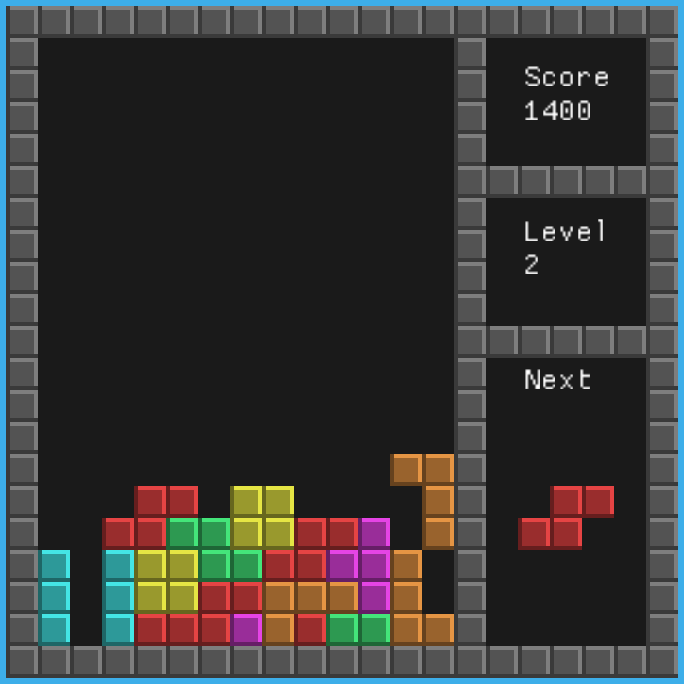

# 🎮 Tetris 🚀

This project is a classic implementation of the popular game Tetris, written in C++ using the SDL2 library. Tetris is a puzzle game where players manipulate falling blocks called "tetrominos" to create complete lines on the game board. When a line is completed, it clears from the board, and the player earns points. The game ends when the stack of tetrominos reaches the top of the game board.

The main objective of this project is to provide a fun and interactive way to play the timeless game of Tetris, while also serving as a practical example of using the SDL2 library for game development in C++.



[🌐 Try it online! 🎮](https://blog.calebe.dev.br/tetris/)

## Features

- Classic Tetris gameplay mechanics.
- Intuitive controls for moving, rotating, and dropping tetrominos.
- Scoring system: earn points by clearing lines and completing levels.
- Display of the next tetromino that will appear.
- Simple and clean user interface.

## Requirements

- C++ compiler
- SDL2 library
- SDL2_ttf library (for rendering text)
- SDL2_mixer library (for sound effects)

## How to Play

1. **Compile the Game:**

```sh
make all
```

2. **Run the Game:**

```sh
./bin/tetris
```

3. **Controls:**
    - **Left Arrow:** Move tetromino left
    - **Right Arrow:** Move tetromino right
    - **Down Arrow:** Soft drop tetromino
    - **Up Arrow or Space:** Rotate tetromino
    - **P:** Pause the game
    - **Esc:** Quit the game

4. **Gameplay:**
    - Tetrominos will fall from the top of the screen. Move and rotate them to fit into the empty spaces.
    - Complete lines by filling all cells in a row. Cleared lines will give you points and prevent the stack from reaching the top.
    - The game speeds up as you clear more lines and progress to higher levels.

## Developer

|         |
|:----------------------------------------------------------------:|
| [Edimar Calebe Castanho (Calebe94)](https://github.com/Calebe94) |

# License

This project is licensed under the [GNU General Public License v3.0 or later](https://www.gnu.org/licenses/gpl-3.0.en.html).
